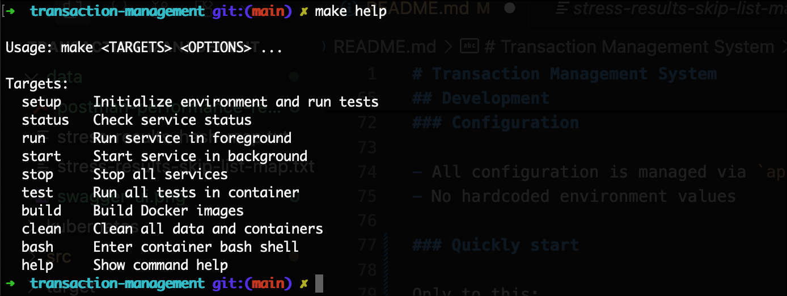
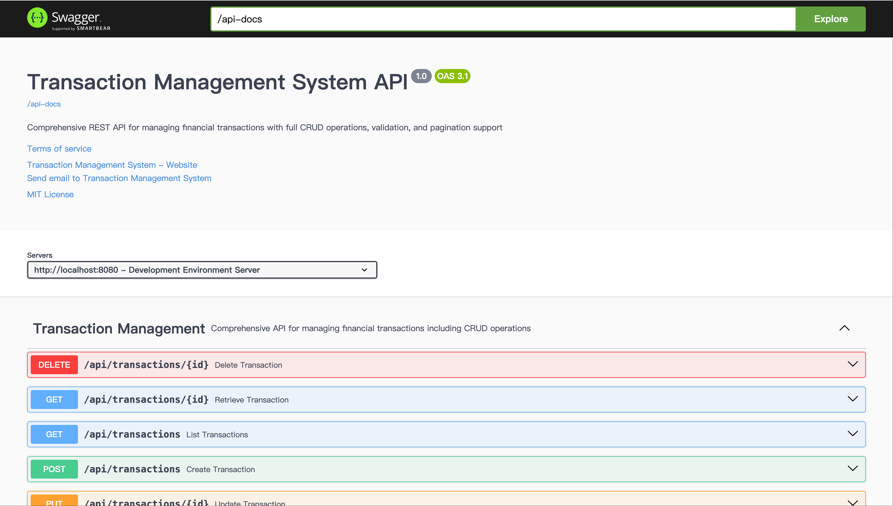

# Transaction Management System

A high-performance, in-memory transaction management application for banking scenarios. 

## Overview

### Features

- Create, view, update, and delete transactions
- In-memory data storage
- RESTful API following best practices
- Robust input validation and exception handling
- Efficient data querying and pagination
- Comprehensive unit and stress testing
- Containerization support (Docker, Kubernetes)
- OpenAPI 3 documentation (Swagger UI)
- Thread-safe, high-performance implementation

### Tech Stack

- Java 21
- Spring Boot 3.5.3
- Maven (build & dependency management)
- JUnit 5, Spring Boot Test (testing)
- Docker, Kubernetes (containerization)
- OpenAPI 3 (API documentation)

### External Libraries

- Spring Boot Starter Web
- Spring Boot Starter Validation  
- Spring Boot Starter Cache
- Spring Boot Starter Test (test scope)
- Lombok
- OpenAPI UI


### Project Structure

```
src/main/java/com/example/transaction/management/
├── config/          # Configuration (OpenAPI, etc.)
├── controller/      # REST API controllers
├── exception/       # Custom exceptions & global handler
├── model/           # Data models (Transaction, TransactionType)
├── repository/      # In-memory data access
├── service/         # Business logic
└── TransactionManagementApplication.java
```

### API Endpoints

| Method | Path                        | Description                             |
|--------|-----------------------------|--------------------------------         |
| GET    | `/api/transactions`         | List all transactions (with pagination) |
| GET    | `/api/transactions/{id}`    | Get a specific transaction              |
| POST   | `/api/transactions`         | Create a new transaction                |
| PUT    | `/api/transactions/{id}`    | Update an existing transaction          |
| DELETE | `/api/transactions/{id}`    | Delete a transaction                    |

- **Transaction fields:** `id`, `amount`, `type` (`DEPOSIT`, `WITHDRAWAL`, `TRANSFER`), `description`, `category`, `timestamp`
- **Validation:** All input is validated using Bean Validation annotations.
- **Error Handling:** Custom exceptions and global handler provide clear error messages.

## Development

### Prerequisites

- Docker 24+
- Make

### Configuration

- All configuration is managed via `application.properties`
- No hardcoded environment values

### Quickly start

Only to this:

```bash
make run # See server at: http://localhost:8080
```

See more commands by `make help`:



### API Documentation

Once running, access the Swagger UI at:  http://localhost:8080/swagger-ui



## Testing

### Unit & Integration Tests

Including controller, service test, all tests passed:

```bash
[INFO] 
[INFO] Results:
[INFO] 
[INFO] Tests run: 23, Failures: 0, Errors: 0, Skipped: 0
[INFO] 
[INFO] ------------------------------------------------------------------------
[INFO] BUILD SUCCESS
[INFO] ------------------------------------------------------------------------
[INFO] Total time:  24.543 s
[INFO] Finished at: 2025-07-09T04:27:20Z
[INFO] ------------------------------------------------------------------------
```

### API Stress Test

API Level comprehensive stress testing performed on 2C4G test machine with 5000 initial transactions. Two repository data structures were compared: HashMap and SkipListMap.

**HashMap Implementation:**

See more in: [tress-results-hash-map.txt](./data/stress-results-hash-map.txt)

| Operation Type      | Success/Total | Failures | Total Time | Throughput   |
|--------------------|---------------|----------|------------|--------------|
| Create Transaction | 5000/5000     | 0        | 5430ms     | ~920 req/s   |
| Update Transaction | 5000/5000     | 0        | 2883ms     | ~1734 req/s  |
| Delete Transaction | 5000/5000     | 0        | 1901ms     | ~2630 req/s  |
| Read Transaction   | 5000/5000     | 0        | 1616ms     | ~3094 req/s  |
| List Transactions  | 5000/5000     | 0        | 4697ms     | ~1064 req/s  |
| Mixed Operations   | 5000/5000     | 0        | 5368ms     | ~931 ops/s   |


**SkipListMap Implementation:**

See more in: [stress-results-skip-list-map.txt](./data/stress-results-skip-list-map.txt)

| Operation Type      | Success/Total | Failures | Total Time | Throughput   |
|--------------------|---------------|----------|------------|--------------|
| Create Transaction | 5000/5000     | 0        | 5605ms     | ~892 req/s   |
| Update Transaction | 5000/5000     | 0        | 3060ms     | ~1634 req/s  |
| Delete Transaction | 5000/5000     | 0        | 1903ms     | ~2627 req/s  |
| Read Transaction   | 5000/5000     | 0        | 1620ms     | ~3086 req/s  |
| List Transactions  | 5000/5000     | 0        | 1975ms     | ~2532 req/s  |
| Mixed Operations   | 5000/5000     | 0        | 2413ms     | ~2072 ops/s  |

**Performance Analysis:**
- HashMap exhibits inconsistent list performance and variable throughput
- SkipListMap shows superior overall performance with more stable throughput
- **Final Implementation:** SkipListMap data structure selected for production use, see [cff627a](https://github.com/songhuangcn/transaction-management/commit/cff627a020b3b73e3b560b291c725415609dcd17)

You can reproduction testing by `make test`(file in: `TransactionStressTest.java`), results are displayed in the console

### Third-party tool performance testing

Performed a mixed stress test via Postman (100 concurrency, 50K requests) with 5K initial data. No errors except 404 responses.

See more in: [postman-performance-report.pdf](./data/postman-performance-report.pdf)

## Deployment

```
kubectl create namespace transaction-management
kubectl apply -k kubernetes/
```

See the sample production server in: https://transaction-management.hdgcs.com (Temporary environment)

## Future Plans

- CI/CD Pipeline
- Monitoring & Alerting
- Security Enhancements
- Architecture Optimization
